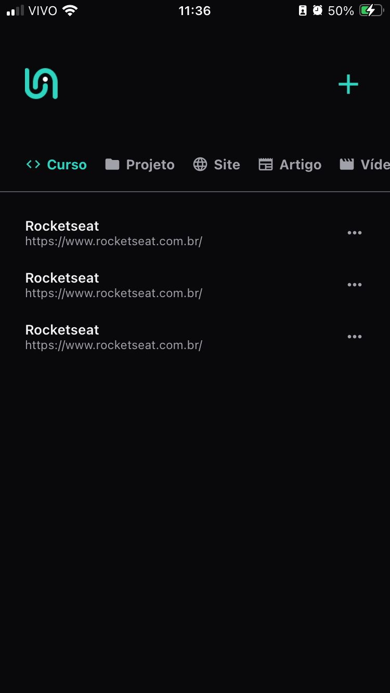
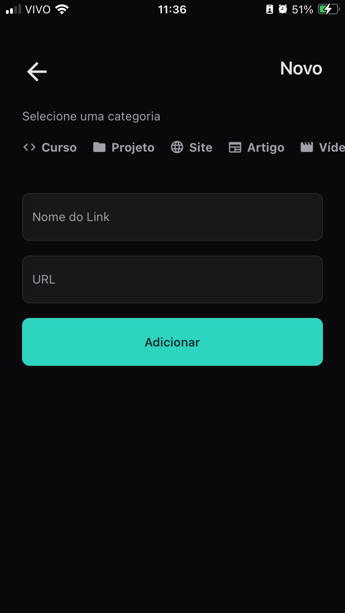

# SaveLink App 📱

<p align="center">
  
</p>

[](https://choosealicense.com/licenses/mit/)
[](https://reactnative.dev/)
[](https://expo.dev/)
[](https://www.typescriptlang.org/)

## 💡 Sobre o Projeto

SaveLink é um aplicativo moderno para gerenciamento de links, permitindo organizar e acessar facilmente seus sites favoritos. Desenvolvido com as mais recentes tecnologias mobile.

## ✨ Funcionalidades

- 📝 Cadastro de links com título e URL
- 🏷️ Categorização intuitiva
- 🔍 Busca rápida
- 🌙 Tema escuro
- 📱 Interface responsiva
- 🔗 Compartilhamento de links

## 🛠️ Tecnologias

- **Frontend:**
  - React Native
  - Expo
  - TypeScript
  - Expo Router
  - Native Base
  - Async Storage

## 📱 Screenshots

<p align="center">
  
  
</p>

## 🚀 Como Executar

```bash
# Clonar o repositório
git clone https://github.com/sirwhod/savelink-app.git

# Instalar dependências
pnpm install

# Iniciar o projeto
pnpm start
```

## 📱 Plataformas Suportadas

- Android
- iOS

## 📫 Contato

 - [GitHub](https://github.com/sirwhod)
 - [LinkedIn](https://www.linkedin.com/in/rodrigo-brandao/)
 - [Email](mailto:rodrigo.brandao98@gmail.com)

## 📝 Licença

Distribuído sob a licença MIT. Veja LICENSE para mais informações.